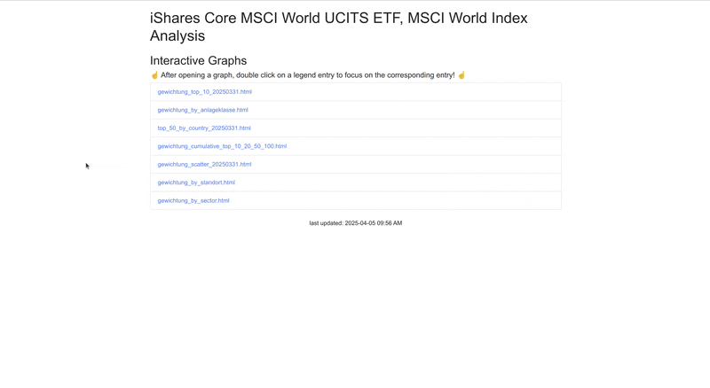

# iShares Core MSCI World UCITS ETF | MSCI World Index Statistics 📈📊🧐

These Jupyter notebooks and Python scripts analyze the `iShares Core MSCI World UCITS ETF` which is based on the MSCI World Index data.
The analysis includes various statistics, visualizations about its constituents.

- Name: iShares Core MSCI World UCITS ETF
- ISIN : IE00B4L5Y983

👉 Jump straight to the [Results](https://html-preview.github.io/?url=https://github.com/niesfisch/etf_index_analysis/blob/main/out/index.html)



## How to View

1. Open the `index.html` file located in the `out` directory in a web browser.
2. Click on the links to view the respective HTML files and images.

Enjoy exploring the data visualizations!

## Setup

To set up the environment for running the Jupyter notebooks and Python scripts, follow these steps:

1. clone this repository and execute the steps under `Create a Virtual Environment with all Dependencies`
2. download all json data via `01_download.py` (via https://www.ishares.com)
3. remove all invalid files and format them via `02_cleanup.py`
4. execute the jupyter notebook `msci_world.ipynb`
5. check the generated data in the `out` directory
6. generate a webpage via `03_generate_website.py`
7. open the `index.html` file in the `out` directory in a web browser

### Create a Virtual Environment with all Dependencies

```bash
# i use pyenv to manage python versions
# install and activate python 3.10
pyenv install 3.10
pyenv virtualenv 3.10 venv-3.10-msci
pyenv activate venv-3.10-msci

# upgrade pip
python -m pip install --upgrade pi
pip install --upgrade pip

# install/upgrade requirements based on the requirements.txt file
pip install --upgrade --force-reinstall -r requirements.txt

# list installed venv, search the current one and use the path configure the python interpreter in the IDE
pyenv virtualenvs

# open your ide and configure the python interpreter to the one in the venv and start the jupyter notebook

# generate licenses
pip-licenses --with-urls --with-system --format=markdown > other_licences.txt

# when you are done, deactivate the venv
# leave virtual environment
pyenv deactivate
```

## Disclaimer

I used python to analyze the data. I am no expert in data analysis not python, so the code may not be perfect 🤓.
I am not responsible for any damage caused by the use of this code. Use it at your own risk.

## License

see [LICENSE](LICENSE)

The data used to generate the statistics is from https://www.ishares.com.

## Tips

You can download [Intellij Ultimate](https://www.jetbrains.com/idea/buy/?section=personal&billing=yearly) and start a trial. 
It has nice coverage of python and jupyter notebooks.

# Notes for myself

```bash
GIT_SSH_COMMAND='ssh -i ~/.ssh/niesfisch' git pull
GIT_SSH_COMMAND='ssh -i ~/.ssh/niesfisch' git push
```